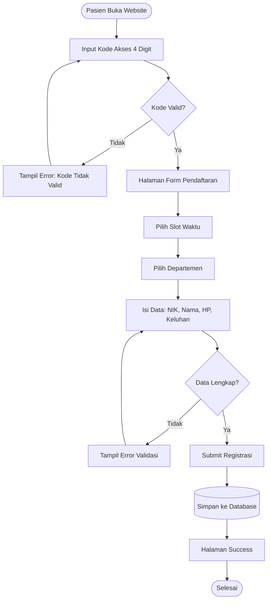
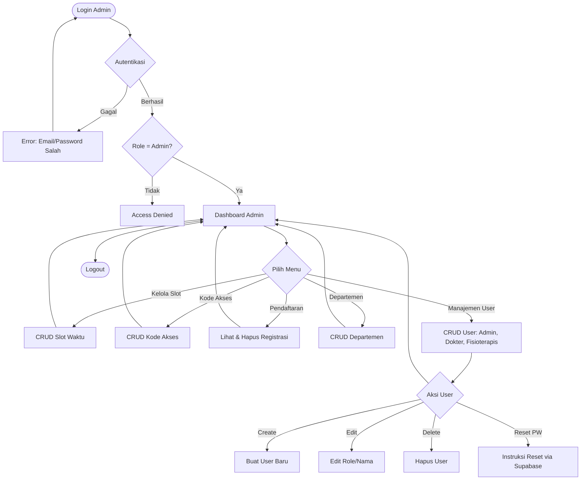
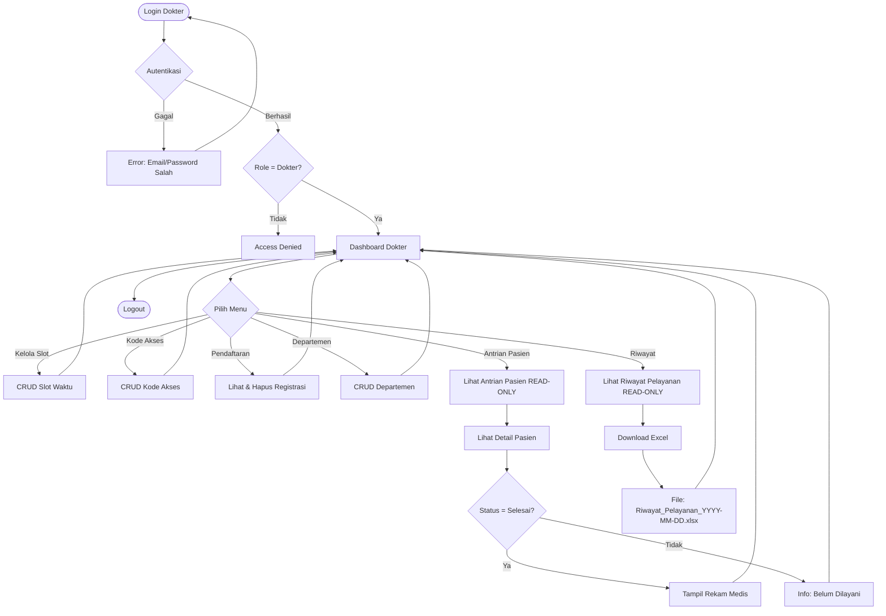
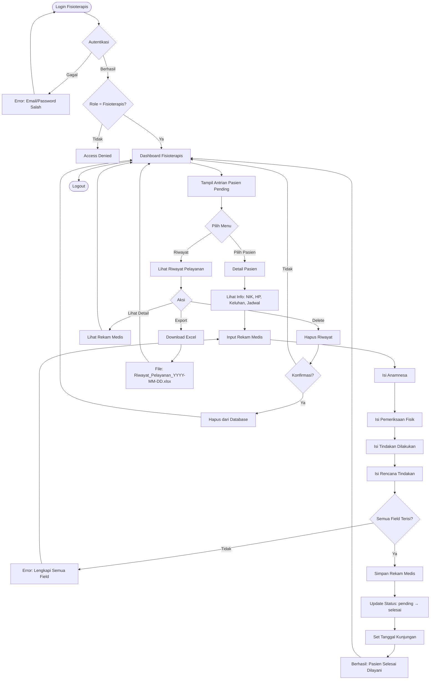
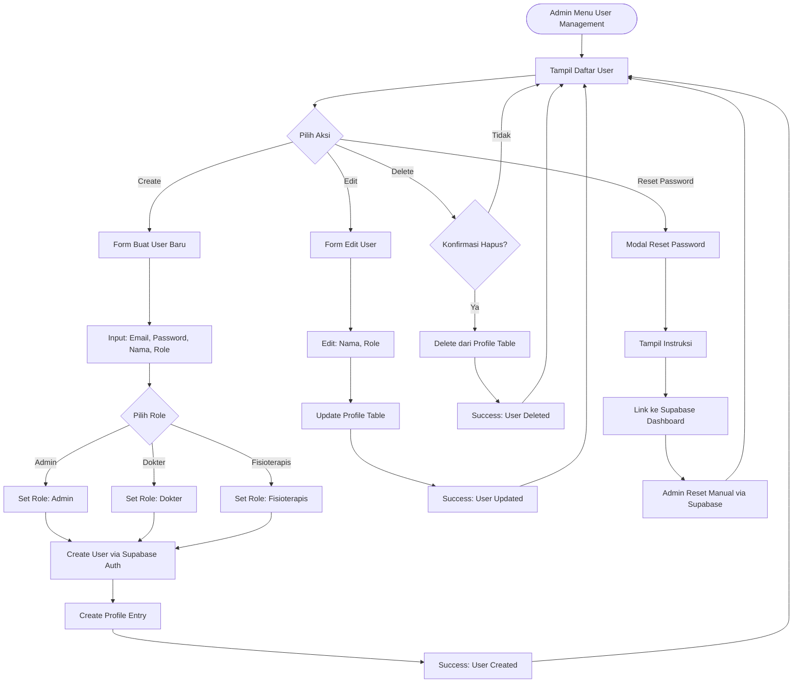

# PhysioBook - Process Flow Documentation

Dokumentasi lengkap alur proses aplikasi **PhysioBook** - Sistem Booking Fisioterapi.

---

## 📊 Daftar Isi

1. [Public Registration Flow](#1-public-registration-flow)
2. [Admin Flow](#2-admin-flow)
3. [Dokter Flow](#3-dokter-flow)
4. [Fisioterapis Flow](#4-fisioterapis-flow)
5. [User Management Flow](#5-user-management-flow)

---

## 1. Public Registration Flow

Alur pendaftaran pasien oleh umum/karyawan.



### Detail Proses:

1. **Input Kode Akses**: Pasien input 4 digit kode akses yang valid
2. **Validasi**: Sistem check kode di database (tabel `access_codes`)
3. **Form**: Pasien isi data diri dan pilih slot
4. **Submit**: Data tersimpan ke tabel `registrations` dengan status `pending`

---

## 2. Admin Flow

Alur kerja untuk role **Admin**.



### Fitur Admin:

- ✅ Dashboard dengan statistik
- ✅ Kelola slot waktu
- ✅ Kelola kode akses
- ✅ Lihat & hapus registrasi
- ✅ Kelola departemen
- ✅ **User management** (create, edit, delete, reset password)

---

## 3. Dokter Flow

Alur kerja untuk role **Dokter** (Admin tanpa user management).



### Fitur Dokter:

- ✅ Semua fitur Admin **kecuali** user management
- ✅ **Antrian Pasien** (read-only)
- ✅ **Riwayat Pelayanan** (read-only)
- ✅ **Download Excel** rekap riwayat

---

## 4. Fisioterapis Flow

Alur kerja untuk role **Fisioterapis** (Input rekam medis).



### Fitur Fisioterapis:

- ✅ Dashboard antrian pasien pending
- ✅ **Input rekam medis** lengkap
- ✅ Riwayat pelayanan
- ✅ **Hapus** riwayat pasien
- ✅ **Download Excel** rekap riwayat

---

## 5. User Management Flow

Alur khusus untuk management user (hanya Admin).



### Detail User Management:

1. **Create User**: Admin input email, password, nama, role → User otomatis confirmed
2. **Edit User**: Admin bisa ubah nama dan role user
3. **Delete User**: Hapus dari `profiles` table (optimistic update)
4. **Reset Password**: Instruksi untuk reset via Supabase Dashboard

---

## 📋 Database Tables

### Tabel Utama:

1. **`access_codes`**

   - `id`, `code`, `department_id`, `slot_id`, `is_used`, `created_at`

2. **`slots`**

   - `id`, `date`, `hour`, `quota`, `created_at`

3. **`departments`**

   - `id`, `name`, `description`, `created_at`

4. **`registrations`**

   - `id`, `access_code_id`, `slot_id`, `department_id`
   - `nik`, `nama_lengkap`, `no_hp`, `keluhan`
   - `status_kunjungan` (`pending` / `selesai`)
   - `anamnesa`, `pemeriksaan_fisik`, `tindakan_dilakukan`, `rencana_tindakan`
   - `tanggal_kunjungan`, `fisioterapis_id`
   - `created_at`

5. **`profiles`**
   - `id`, `email`, `role` (`admin` / `dokter` / `fisioterapis`)
   - `full_name`, `created_at`, `updated_at`

---

## 🔐 Authentication & Authorization

### Authentication Method:

- **Supabase Auth** (email + password)

### Role-Based Access:

| Role             | Access                                                         |
| ---------------- | -------------------------------------------------------------- |
| **Public**       | Registrasi pasien (input kode akses)                           |
| **Admin**        | Full access (dashboard, CRUD semua, user management)           |
| **Dokter**       | Admin tanpa user management + view antrian/riwayat (read-only) |
| **Fisioterapis** | Input rekam medis + view/delete riwayat                        |

### Route Protection:

- `/admin/*` → Admin & Dokter only
- `/fisioterapis/*` → Fisioterapis only
- Public routes tanpa auth

---

## 📊 Export Excel

### Fitur Export:

- **Tersedia untuk**: Dokter & Fisioterapis
- **Halaman**: Riwayat Pelayanan
- **Format**: `.xlsx` (Excel 2007+)
- **Data**:
  - No, Nama, NIK, HP, Departemen
  - Keluhan, Tanggal Kunjungan
  - Anamnesa, Pemeriksaan Fisik
  - Tindakan Dilakukan, Rencana Tindakan

### Filename Format:

```
Riwayat_Pelayanan_2026-01-04.xlsx
```

---

## 🚀 Deployment

- **Platform**: Vercel
- **URL**: https://booking-fisioterapi-ppabib.vercel.app
- **Database**: Supabase
- **Auto Deploy**: Push to `main` branch

---

## 📝 Notes

1. **Email Confirmation**: Disabled di Supabase untuk user creation
2. **RLS**: Disabled pada `profiles` table untuk kemudahan management
3. **Password Reset**: Manual via Supabase Dashboard (admin guided)
4. **Status Kunjungan**: `pending` → `selesai` (set by Fisioterapis)

---

**Last Updated**: 2026-01-04  
**Version**: 1.0.0
